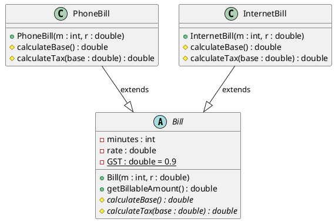

```plantuml
@startuml

abstract class Bill {
-minutes : int
-rate : double
{static} -GST : double = 0.9
+Bill(m : int, r : double)
+getBillableAmount() : double
{abstract} #calculateBase() : double
{abstract} #calculateTax(base : double) : double
}

class PhoneBill {
+PhoneBill(m : int, r : double)
#calculateBase() : double
#calculateTax(base : double) : double
}

class InternetBill {
+InternetBill(m : int, r : double)
#calculateBase() : double
#calculateTax(base : double) : double
}

PhoneBill --|> Bill : extends
InternetBill --|> Bill : extends

@enduml


```