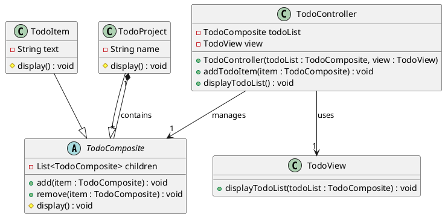

```plantuml
@startuml
' ------- Models -------
abstract class TodoComposite {
   {field} -List<TodoComposite> children
   {method} +add(item : TodoComposite) : void
   {method} +remove(item : TodoComposite) : void
   {method} #display() : void
}

class TodoItem {
   {field} -String text
   {method} #display() : void
}

class TodoProject {
   {field} -String name
   {method} #display() : void
}

' ------- View -------
class TodoView {
   {method} +displayTodoList(todoList : TodoComposite) : void
}

' ------- Controller -------
class TodoController {
   {field} -TodoComposite todoList
   {field} -TodoView view
   {method} +TodoController(todoList : TodoComposite, view : TodoView)
   {method} +addTodoItem(item : TodoComposite) : void
   {method} +displayTodoList() : void
}

' ------- Inheritance & Composition -------
TodoItem --|> TodoComposite
TodoProject --|> TodoComposite
TodoProject "1" *-- "*" TodoComposite : contains
TodoController --> "1" TodoComposite : manages
TodoController --> "1" TodoView : uses
@enduml
```