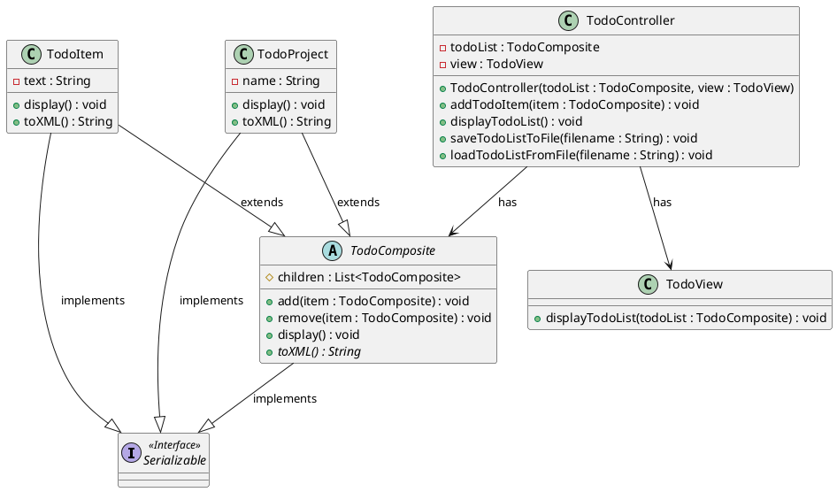

```plantuml
@startuml

interface Serializable <<Interface>> {
}

abstract class TodoComposite {
  #children : List<TodoComposite>
  +add(item : TodoComposite) : void
  +remove(item : TodoComposite) : void
  +display() : void
  {abstract} +toXML() : String
}

class TodoItem {
  -text : String
  +display() : void
  +toXML() : String
}

class TodoProject {
  -name : String
  +display() : void
  +toXML() : String
}

class TodoController {
  -todoList : TodoComposite
  -view : TodoView
  +TodoController(todoList : TodoComposite, view : TodoView)
  +addTodoItem(item : TodoComposite) : void
  +displayTodoList() : void
  +saveTodoListToFile(filename : String) : void
  +loadTodoListFromFile(filename : String) : void
}

class TodoView {
  +displayTodoList(todoList : TodoComposite) : void
}

TodoItem --|> TodoComposite : extends
TodoProject --|> TodoComposite : extends
TodoItem --|> Serializable : implements
TodoProject --|> Serializable : implements
TodoComposite --|> Serializable : implements
TodoController -down-> TodoComposite : has
TodoController -down-> TodoView : has

@enduml

```