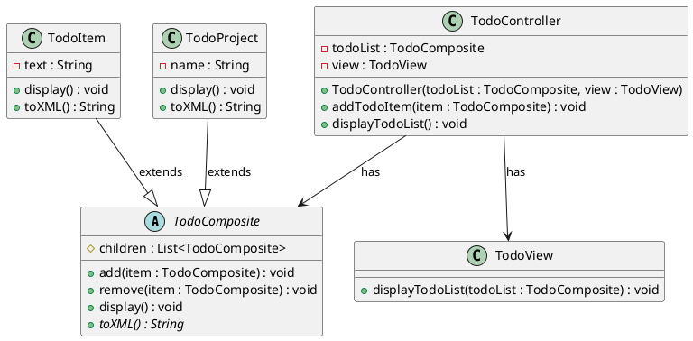

```plantuml
  @startuml
  abstract class TodoComposite {
    #children : List<TodoComposite>
    +add(item : TodoComposite) : void
    +remove(item : TodoComposite) : void
    +display() : void
    {abstract} +toXML() : String
  }

  class TodoItem {
    -text : String
    +display() : void
    +toXML() : String
  }

  class TodoProject {
    -name : String
    +display() : void
    +toXML() : String
  }

  class TodoController {
    -todoList : TodoComposite
    -view : TodoView
    +TodoController(todoList : TodoComposite, view : TodoView)
    +addTodoItem(item : TodoComposite) : void
    +displayTodoList() : void
  }

  class TodoView {
    +displayTodoList(todoList : TodoComposite) : void
  }

  TodoItem --|> TodoComposite : extends
  TodoProject --|> TodoComposite : extends
  TodoController -down-> TodoComposite : has
  TodoController -down-> TodoView : has
  @enduml
```