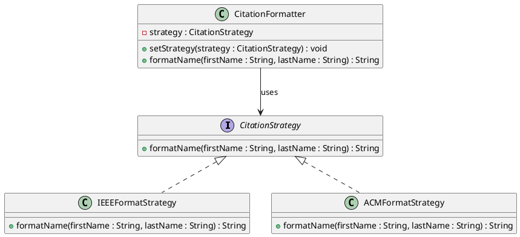

@enduml

```plantuml
@startuml

interface CitationStrategy {
+formatName(firstName : String, lastName : String) : String
}

class IEEEFormatStrategy {
+formatName(firstName : String, lastName : String) : String
}

class ACMFormatStrategy {
+formatName(firstName : String, lastName : String) : String
}

class CitationFormatter {
-strategy : CitationStrategy
+setStrategy(strategy : CitationStrategy) : void
+formatName(firstName : String, lastName : String) : String
}

CitationStrategy <|.. IEEEFormatStrategy
CitationStrategy <|.. ACMFormatStrategy
CitationFormatter --> CitationStrategy : uses
```