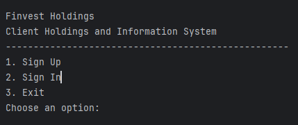
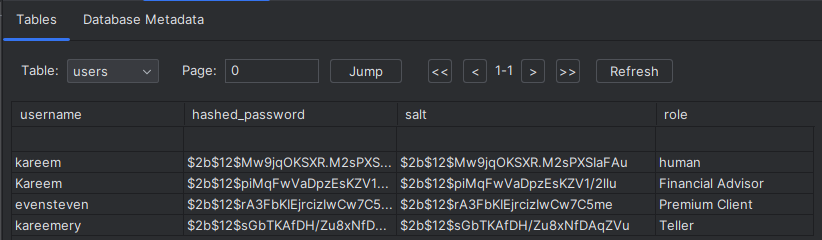

# Prototype Summary: User Authentication and Access Control System

<!-- TOC -->
* [Prototype Summary: User Authentication and Access Control System](#prototype-summary-user-authentication-and-access-control-system)
  * [Introduction](#introduction)
  * [Problem 1: Access Control Mechanism](#problem-1-access-control-mechanism)
    * [Access Control Model Selection](#access-control-model-selection)
    * [Access Control Representation](#access-control-representation)
    * [Design and Implementation](#design-and-implementation)
      * [Code Samples](#code-samples)
      * [Design Sketch](#design-sketch)
    * [Testing](#testing)
  * [Problem 2: Password File](#problem-2-password-file)
    * [Hash Function Selection](#hash-function-selection)
    * [Password File Record Structure](#password-file-record-structure)
    * [Implementation](#implementation)
    * [Testing](#testing-1)
  * [Problem 3: User Enrollment](#problem-3-user-enrollment)
    * [User Interface Design](#user-interface-design)
    * [Proactive Password Checker](#proactive-password-checker)
    * [Implementation](#implementation-1)
      * [Common Passwords](#common-passwords)
    * [Testing](#testing-2)
  * [Problem 4: User Login and Access Control Enforcement](#problem-4-user-login-and-access-control-enforcement)
    * [User Interface Design](#user-interface-design-1)
      * [Sample Simulation: Sign-up, Sign-in, Display Info, and Exit for a given User](#sample-simulation-sign-up-sign-in-display-info-and-exit-for-a-given-user)
    * [Access Control Enforcement](#access-control-enforcement)
    * [Testing](#testing-3)
  * [Demonstration and Usage](#demonstration-and-usage)
    * [Running the Prototype](#running-the-prototype)
    * [Sample Use Case](#sample-use-case)
    * [Screenshots and Testing](#screenshots-and-testing)
<!-- TOC -->

## Introduction

This document provides a comprehensive summary of the prototype user authentication and access control system developed
for Finest Holdings.

## Problem 1: Access Control Mechanism

### Access Control Model Selection

- **Model**: Role-Based Access Control (RBAC)
- **Justification**: RBAC's effectiveness in aligning with organizational roles and permissions made it the ideal
  choice.

### Access Control Representation

- **Representation**: Access Control List (ACL)
- **Justification**: ACL provides a manageable and clear mapping of roles to permissions.

### Design and Implementation

- **Roles and Permissions**: Defined roles (e.g., 'Regular Client', 'Premium Client') with specific permissions (e.g., '
  view_account_balance').
- **System Implementation**: Implemented in Python, ensuring user roles align with permissions for actions.

#### Code Samples
The best way to view the system in action is to examine the tests. Particularly `test_access_control.py`

Initially, The database is injected with users. These users are the same from the sample list provided by Finvest Holdings.

```python
@classmethod
    def setUpClass(cls):
        # print(f"Creating test database at: {cls.test_db_path}")
        create_database(cls.test_db_path)
        add_user(cls.test_db_path, "Mischa Lowery", "password123", "Regular Client")
        add_user(cls.test_db_path, "Veronica Perez", "password123", "Regular Client")
        add_user(cls.test_db_path, "Willow Garza", "password123", "Premium Client")
        add_user(cls.test_db_path, "Nala Preston", "password123", "Premium Client")
        add_user(cls.test_db_path, "Winston Callahan", "password123", "Teller")
        add_user(cls.test_db_path, "Kelan Gough", "password123", "Teller")
        add_user(cls.test_db_path, "Nelson Wilkins", "password123", "Financial Advisor")
        add_user(cls.test_db_path, "Kelsie Chang", "password123", "Financial Advisor")
        add_user(cls.test_db_path, "Howard Linkler", "password123", "Compliance Officer")
        add_user(cls.test_db_path, "Stefania Smart", "password123", "Compliance Officer")
        add_user(cls.test_db_path, "Kodi Matthews", "password123", "Financial Planner")
        add_user(cls.test_db_path, "Malikah Wu", "password123", "Financial Planner")
        add_user(cls.test_db_path, "Stacy Kent", "password123", "Investment Analyst")
        add_user(cls.test_db_path, "Keikilana Kapahu", "password123", "Investment Analyst")
        add_user(cls.test_db_path, "Caroline Lopez", "password123", "Technical Support")
        add_user(cls.test_db_path, "Pawel Barclay", "password123", "Technical Support")
```
Within `roles.py` we can examine the roles, permissions, and acl structure for the project
```python
roles: dict[str, Role] = {
    "Regular Client": Role(
        "Regular Client",
        [
            "view_account_balance",
            "view_investments_portfolio",
            "view_financial_advisor_contact",
        ],
    ),
    "Premium Client": Role(
        "Premium Client",
        [
            "view_account_balance",
            "view_investments_portfolio",
            "modify_investment_portfolio",
            "view_financial_advisor_contact",
            "view_investment_analyst_contact",
        ],
    ),
    "Teller": Role(
        "Teller",
        [
            "view_client_balance",
            "view_client_investment_portfolio",
            "access_system_during_business_hours",
        ],
    ),
    "Financial Advisor": Role(
        "Financial Advisor",
        [
            "view_client_balance",
            "view_client_investment_portfolio",
            "modify_client_investment_portfolio",
            "view_private_consumer_instruments",
        ],
    ),
    "Compliance Officer": Role(
        "Compliance Officer",
        [
            "view_client_balance",
            "view_client_investment_portfolio",
            "validate_investment_portfolio_modifications",
        ],
    ),
    "Financial Planner": Role(
        "Financial Planner",
        [
            "view_client_balance",
            "view_client_investment_portfolio",
            "modify_client_investment_portfolio",
            "view_money_market_instruments",
            "view_private_consumer_instruments",
        ],
    ),
    "Investment Analyst": Role(
        "Investment Analyst",
        [
            "view_client_balance",
            "view_client_investment_portfolio",
            "view_derivatives_trading",
            "modify_client_investment_portfolio",
            "view_money_market_instruments",
            "view_interest_instruments",
            "view_private_consumer_instruments",
        ],
    ),
    "Technical Support": Role(
        "Technical Support",
        [
            "view_client_balance",
            "view_client_investment_portfolio",
            "view_client_information",
            "request_client_account_access",
        ],
    ),
}

acl = {
    "account_balance": {
        "Regular Client": ["view_account_balance"],
        "Premium Client": ["view_account_balance"],
        "Teller": ["view_client_balance"],
        "Financial Advisor": ["view_client_balance"],
        "Compliance Officer": ["view_client_balance"],
        "Financial Planner": ["view_client_balance"],
        "Investment Analyst": ["view_client_balance"],
        "Technical Support": ["view_client_balance"],
    },
    "investments_portfolio": {
        "Regular Client": ["view_investments_portfolio"],
        "Premium Client": ["view_investments_portfolio", "modify_investment_portfolio"],
        "Teller": ["view_client_investment_portfolio"],
        "Financial Advisor": ["view_client_investment_portfolio", "modify_client_investment_portfolio"],
        "Compliance Officer": ["view_client_investment_portfolio"],
        "Financial Planner": ["view_client_investment_portfolio", "modify_client_investment_portfolio"],
        "Investment Analyst": ["view_client_investment_portfolio", "modify_client_investment_portfolio"],
        "Technical Support": ["view_client_investment_portfolio"],
    },
    "financial_advisor_contact": {
        "Regular Client": ["view_financial_advisor_contact"],
        "Premium Client": ["view_financial_advisor_contact"],
        "Technical Support": ["view_client_information"],
    },
    "investment_analyst_contact": {
        "Premium Client": ["view_investment_analyst_contact"],
        "Technical Support": ["view_client_information"],
    },
    "private_consumer_instruments": {
        "Financial Advisor": ["view_private_consumer_instruments"],
        "Financial Planner": ["view_private_consumer_instruments"],
        "Investment Analyst": ["view_private_consumer_instruments"],
    },
    "money_market_instruments": {
        "Financial Planner": ["view_money_market_instruments"],
        "Investment Analyst": ["view_money_market_instruments"],
    },
    "interest_instruments": {
        "Investment Analyst": ["view_interest_instruments"],
    },
    "derivatives_trading": {
        "Investment Analyst": ["view_derivatives_trading"],
    },
    "access_system_during_business_hours": {
        "Teller": ["access_system_during_business_hours"],
    },
    "validate_investment_portfolio_modifications": {
        "Compliance Officer": ["validate_investment_portfolio_modifications"],
    },
    "request_client_account_access": {
        "Technical Support": ["request_client_account_access"],
    },
    "view_client_information": {
        "Technical Support": ["view_client_information"],
    },

}
```
We can immediately see the benefits of this structure as changes in permissions or addition of roles is quite easy.


#### Design Sketch
Note: This was generated from the `create_access_matrix_df` method within `roles.py` but please be aware that the naming of the method is misleading. It still provides a good visual graphic though!

| Roles/Resources    | access_system_during_business_hours | account_balance      | derivatives_trading      | financial_advisor_contact      | interest_instruments      | investment_analyst_contact      | investments_portfolio                                                | money_market_instruments      | private_consumer_instruments      | request_client_account_access | validate_investment_portfolio_modifications | view_client_information |
|:-------------------|:------------------------------------|:---------------------|:-------------------------|:-------------------------------|:--------------------------|:--------------------------------|:---------------------------------------------------------------------|:------------------------------|:----------------------------------|:------------------------------|:--------------------------------------------|:------------------------|
| Regular Client     |                                     | view_account_balance |                          | view_financial_advisor_contact |                           |                                 | view_investments_portfolio                                           |                               |                                   |                               |                                             |                         |
| Premium Client     |                                     | view_account_balance |                          | view_financial_advisor_contact |                           | view_investment_analyst_contact | view_investments_portfolio, modify_investment_portfolio              |                               |                                   |                               |                                             |                         |
| Teller             | access_system_during_business_hours | view_client_balance  |                          |                                |                           |                                 | view_client_investment_portfolio                                     |                               |                                   |                               |                                             |                         |
| Financial Advisor  |                                     | view_client_balance  |                          |                                |                           |                                 | view_client_investment_portfolio, modify_client_investment_portfolio |                               | view_private_consumer_instruments |                               |                                             |                         |
| Compliance Officer |                                     | view_client_balance  |                          |                                |                           |                                 | view_client_investment_portfolio                                     |                               |                                   |                               | validate_investment_portfolio_modifications |                         |
| Financial Planner  |                                     | view_client_balance  |                          |                                |                           |                                 | view_client_investment_portfolio, modify_client_investment_portfolio | view_money_market_instruments | view_private_consumer_instruments |                               |                                             |                         |
| Investment Analyst |                                     | view_client_balance  | view_derivatives_trading |                                | view_interest_instruments |                                 | view_client_investment_portfolio, modify_client_investment_portfolio | view_money_market_instruments | view_private_consumer_instruments |                               |                                             |                         |
| Technical Support  |                                     | view_client_balance  |                          | view_client_information        |                           | view_client_information         | view_client_investment_portfolio                                     |                               |                                   | request_client_account_access |                                             | view_client_information |

### Testing

- **Method**: Python's `unittest` framework.
- Please view and run `test_access_control.py` to see the system in a simulated test.

## Problem 2: Password File

### Hash Function Selection

- **Algorithm**: bcrypt for hashing passwords.
- **Justification**: bcrypt's salted hashes and security features are ideal for preventing brute-force attacks.

### Password File Record Structure

- **Structure**: SQLite database records with username, hashed password, salt, and user role.
- Following same procedure described in Figure 2 of the assignment document.
- Selected SQLite over the suggested `passwd.txt` file as it offers better features and is still in plaintext

### Implementation

- **Technology**: Python and SQLite.
- **Functionality**: Secure storage and retrieval of hashed passwords.

Please examine `database.py` to see how the system uses BCrypt to store the hash and the salt in the sqlite database. 

Here is a sample where we can see how a salt is added to the user object before being added to the database 
```python
def add_user(db_path, username, password, role):
    conn = sqlite3.connect(db_path)
    c = conn.cursor()

    # Check if the user already exists
    c.execute("SELECT * FROM users WHERE username = ?", (username,))
    if c.fetchone():
        print(f"User '{username}' already exists. Skipping.")
        pass
    else:
        salt = bcrypt.gensalt()
        hashed_password = bcrypt.hashpw(password.encode(), salt)
        c.execute('''
            INSERT INTO users (username, hashed_password, salt, role) 
            VALUES (?, ?, ?, ?)
        ''', (username, hashed_password.decode(), salt.decode(), role))
        conn.commit()

    conn.close()
```


### Testing

- **Focus**: Security of password storage and integrity of the hashing mechanism.

## Problem 3: User Enrollment

### User Interface Design

- **Interface**: Command-line interface for inputting username, password, and role.
- Followed the same design as the one proposed in the assignment document



### Proactive Password Checker

- **Functionality**: Enforces password policies and checks against common password lists.

### Implementation

- **Integration**: Seamlessly adds new users to the database after password validation.

#### Common Passwords
I used this [list of common passwords](https://github.com/danielmiessler/SecLists/blob/master/Passwords/Common-Credentials/10-million-password-list-top-10000.txt) provided by [SecLists](https://github.com/danielmiessler/SecLists/tree/master). 

All the passwords within that list of common passwords are forbidden as passwords for any user. The system also implements the following:
  - Passwords must have a minimum length of 8
  - Passwords must include:
    - 1 upper-case letter;
    - 1 lower-case letter;
    - one number;
    - one special character (!@#$%^&*);
  - Passwords cannot match the format of license plates, postal codes, telephone numbers, and calendar dates.
  - Finally, the username cannot be within the password.
This test is a good example of how this system 

We can see the implementation within `password_checker.py`

It is even clearer to examine the tests in `test_password_checker.py`. We can see in there that all these cases are tested for:
```python
# test_password_checker.py
import unittest
from src.authentication.password_checker import is_password_valid


class TestPasswordChecker(unittest.TestCase):
    def test_valid_password(self):
        self.assertTrue(is_password_valid("Soccer123!", "user"))

    def test_password_length_short(self):
        self.assertFalse(is_password_valid("Short1!", "user"))

    def test_no_number(self):
        self.assertFalse(is_password_valid("NoNumber!", "user"))

    def test_user_id_match(self):
        self.assertFalse(is_password_valid("user123!", "user"))

    def test_no_special_char(self):
        self.assertFalse(is_password_valid("NoSpecial0", "user"))

    def test_no_uppercase(self):
        self.assertFalse(is_password_valid("nouppercase1!", "user"))

    def test_no_lowercase(self):
        self.assertFalse(is_password_valid("NOLOWERCASE1!", "user"))

    def test_common_password(self):
        self.assertFalse(is_password_valid("Password123!", "user"))

    def test_date_format_password(self):
        self.assertFalse(is_password_valid("01/01/2000", "user"))


if __name__ == "__main__":
    unittest.main()

```

### Testing

- **Scenarios**: Includes weak password rejection and successful user addition.

## Problem 4: User Login and Access Control Enforcement

### User Interface Design

- **Interface**: Command-line interface for user login.


#### Sample Simulation: Sign-up, Sign-in, Display Info, and Exit for a given User
```text
Finvest Holdings
Client Holdings and Information System
---------------------------------------------------
1. Sign Up
2. Sign In
3. Exit
Choose an option: 1

Enrolment Process
Enter username: kareemery
Enter password: SecurePassword123!
Enter role: Teller
USER ENROLMENT SUCCESSFUL.

Finvest Holdings
Client Holdings and Information System
---------------------------------------------------
1. Sign Up
2. Sign In
3. Exit
Choose an option: 2

Login Process
Enter username: kareemery
Enter password: SecurePassword123!
ACCESS GRANTED

User Information:
User ID: kareemery
Role: Teller
Permissions: view_client_balance, view_client_investment_portfolio, access_system_during_business_hours

Options:
1. Logout
2. Exit
Choose an action: 2

Process finished with exit code 0
```

The implementation for this can be found in `main.py`:
```python
from src.enrolment.enrolment import enrol_user, user_login
from src.authentication.database import create_database
from src.access_control.control import can_perform_action


def main():
    create_database()

    while True:
        print("\nFinvest Holdings")
        print("Client Holdings and Information System")
        print("---------------------------------------------------")
        print("1. Sign Up")
        print("2. Sign In")
        print("3. Exit")
        choice = input("Choose an option: ")

        if choice == "1":
            enrol_user("finvest.db")
        elif choice == "2":
            user = user_login("finvest.db")
            if user:
                print(f"\nUser Information:")
                print(f"User ID: {user.name}")
                print(f"Role: {user.role.name}")
                print(f"Permissions: {', '.join(user.role.permissions)}")

                while True:
                    print("\nOptions:")
                    print("1. Logout")
                    print("2. Exit")
                    action_choice = input("Choose an action: ")
                    if action_choice == "1":
                        break
                    elif action_choice == "2":
                        exit()
                    else:
                        print("Invalid option.")
            else:
                print("Invalid login credentials.")
        elif choice == "3":
            break
        else:
            print("Invalid choice. Please try again.")


if __name__ == "__main__":
    main()

```

### Access Control Enforcement

- **Display**: Shows user ID, role, and permissions post-login.

### Testing

- My approach uses `@patch` from `unittest.mock` to simulate the response from the user expected from input(). This way we can more quickly simulate the interaction.
- I was able to test the creation of all the different types of roles needed. Please see `test_access_control.py` and `test_enrolment.py` to see it personally.
- Here is a snippet showing some important tests:
```python
class TestAccessControl(unittest.TestCase):
    test_db_path = "test_finvest.db"

    @classmethod
    def setUpClass(cls):
        # print(f"Creating test database at: {cls.test_db_path}")
        create_database(cls.test_db_path)
        add_user(cls.test_db_path, "Mischa Lowery", "Password123!", "Regular Client")
        add_user(cls.test_db_path, "Veronica Perez", "Password123!", "Regular Client")
        add_user(cls.test_db_path, "Willow Garza", "Password123!", "Premium Client")
        add_user(cls.test_db_path, "Nala Preston", "Password123!", "Premium Client")
        add_user(cls.test_db_path, "Winston Callahan", "Password123!", "Teller")
        add_user(cls.test_db_path, "Kelan Gough", "Password123!", "Teller")
        add_user(cls.test_db_path, "Nelson Wilkins", "Password123!", "Financial Advisor")
        add_user(cls.test_db_path, "Kelsie Chang", "Password123!", "Financial Advisor")
        add_user(cls.test_db_path, "Howard Linkler", "Password123!", "Compliance Officer")
        add_user(cls.test_db_path, "Stefania Smart", "Password123!", "Compliance Officer")
        add_user(cls.test_db_path, "Kodi Matthews", "Password123!", "Financial Planner")
        add_user(cls.test_db_path, "Malikah Wu", "Password123!", "Financial Planner")
        add_user(cls.test_db_path, "Stacy Kent", "Password123!", "Investment Analyst")
        add_user(cls.test_db_path, "Keikilana Kapahu", "Password123!", "Investment Analyst")
        add_user(cls.test_db_path, "Caroline Lopez", "Password123!", "Technical Support")
        add_user(cls.test_db_path, "Pawel Barclay", "Password123!", "Technical Support")

    @classmethod
    def tearDownClass(cls):
        os.remove("test_finvest.db")

    # Database-related tests
    def test_add_and_get_user(self):
        username = "testuser"
        password = "testpassword"
        role = "Regular Client"
        add_user(self.test_db_path, username, password, role)
        user = get_user(self.test_db_path, username)
        self.assertIsNotNone(user)
        self.assertEqual(user[0], username)
        # self.assertTrue(bcrypt.checkpw(password.encode(), user[1].encode()))
        self.assertEqual(user[3], role)

    # Authentication and access control tests
    def test_user_authentication(self):
        user = authenticate_user("Nala Preston", "Password123!", self.test_db_path)
        self.assertIsNotNone(user)

    def test_invalid_authentication(self):
        user = authenticate_user("Nala Preston", "wrong_password", self.test_db_path)
        self.assertIsNone(user)

    # test each role 
    def test_regular_client_permissions(self):
        user = authenticate_user("Mischa Lowery", "Password123!", self.test_db_path)
        self.assertTrue(can_perform_action(user, "view_account_balance", "account_balance"))
        self.assertFalse(can_perform_action(user, "modify_investment_portfolio", "investments_portfolio"))

    def test_premium_client_permissions(self):
        user = authenticate_user("Willow Garza", "Password123!", self.test_db_path)
        self.assertTrue(can_perform_action(user, "view_investments_portfolio", "investments_portfolio"))
        self.assertTrue(can_perform_action(user, "modify_investment_portfolio", "investments_portfolio"))
    def test_unauthorized_access(self):
        user = authenticate_user("UnauthorizedUser", "password123", self.test_db_path)
        self.assertIsNone(user)

    def test_invalid_role(self):
        with self.assertRaises(ValueError):
            User("InvalidRoleUser", "NonExistingRole")
```

As you can see, users from the given table are added to the database, getting and setting are both tested, invalid edge cases are tests, and 3 roles are authenticated and verified that they return the info they should

## Demonstration and Usage

### Running the Prototype Locally

1. **Setup**: Requires Python 3.x.
2. **Virtual Environment**: Run `python -m venv venv` and make sure that your terminal prints (venv) at the end of every execution.
3. **Dependencies**: Run `pip install -r requirements.txt`
4. **Execution**: Run `python main.py` in the project directory.
5. **Operation**: Follow the prompts for user enrollment or login.
6. **Tests**: Run `test_access_control.py`, `test_enrolment.py`, and `test_password_checker.py`

### Running the Prototype on the VM

1. **Setup**: Requires Python 3.x.
2. **Update VM**: Run the following commands:
   - `sudo apt-get update`
   - `sudo apt-get upgrade`
   - Verify that python is up-to-date: `python3 --version`
3. **Virtual Environment**: Run `python3 -m venv venv` and make sure that your terminal prints (venv) at the end of every execution.
4. **Dependencies**: Run `python3 -m pip install -r requirements.txt`
5. **Execution**: Run `python3 src/main.py` in the project directory.
6. **Operation**: Follow the prompts for user enrollment or login.
7. **Tests**: Run `test_access_control.py`, `test_enrolment.py`, and `test_password_checker.py`

### Sample Use Case

- **Enrollment Process**:
    1. Choose 'Sign Up'.
    2. Input username, password, and role.
    3. Confirmation upon successful enrollment.

- **Login Process**:
    1. Choose 'Sign In'.
    2. Enter username and password.
    3. Post-login, user details and permissions are displayed.

### Screenshots


```bash
Finvest Holdings
Client Holdings and Information System
---------------------------------------------------
1. Sign Up
2. Sign In
3. Exit
Choose an option: 1

Enrolment Process
Enter username: kareemery
Enter password: SecurePassword123!
Enter role: Teller
USER ENROLMENT SUCCESSFUL.

Finvest Holdings
Client Holdings and Information System
---------------------------------------------------
1. Sign Up
2. Sign In
3. Exit
Choose an option: 2

Login Process
Enter username: kareemery
Enter password: SecurePassword123!
ACCESS GRANTED

User Information:
User ID: kareemery
Role: Teller
Permissions: view_client_balance, view_client_investment_portfolio, access_system_during_business_hours

Options:
1. Logout
2. Exit
Choose an action: 2

Process finished with exit code 0
```

---

*Document prepared for Finvest Holdings to evaluate the security and functionality of the prototype system.*
